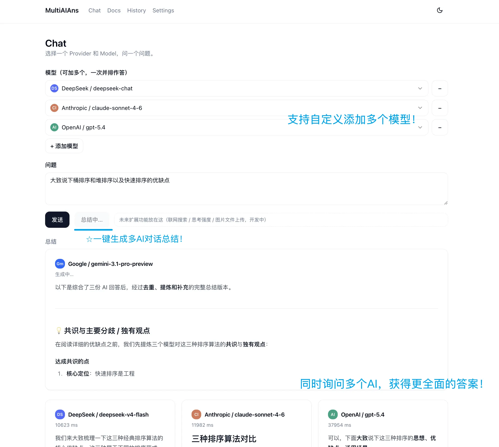

# MultiAIAns

MultiAIAns 是一个轻量的多模型问答工具。

它的目标很简单：  
同一个问题，同时问多个 AI 模型，把回答放在一起看，最大程度避免单个模型的幻觉和片面性，更加全面的看待问题。
需要的话，再让其中一个模型把所有回答整理成一份更完整、更稳妥的版本。

---



## 为什么做这个

平时用 AI 的时候，经常会遇到几种情况：

- 一个模型回答得快，但细节不够。
- 一个模型逻辑不错，但容易保守。
- 一个模型想法多，但偶尔会飘。
- 同一个模型多问几次，答案也会有差异。

所以 MultiAIAns 想做的是：

1. 同一个问题，可以同时问多个模型。
2. 每个模型可以重复问几次。
3. 所有回答直接并排展示，不替用户藏起来。
4. 可选让一个模型总结所有回答，给出一个综合版本。
5. 后面再支持模型之间互相审阅、补充、修正。

简单说，它不是想再做一个普通 ChatBot WebUI，而是想做一个“多模型回答对照和整理工具”。

## 功能

- 多模型并排作答，流式输出，回答按 Markdown 渲染
- 一键把多个回答总结成一份综合版（指出共识与分歧）
- 浅色 / 深色模式
- 兼容任意 OpenAI-compatible 接口：OpenAI、DeepSeek、本地 Ollama 等都行
- 配置和请求记录只存在你自己的浏览器，API Key 不上传、不入库

## Roadmap
- 在 Settings 添加模型时，填好 Base URL + API Key 后自动拉取该 Provider 的所有可用模型及其支持的功能（像其他 AI 软件那样），逐个加入。
- 临时上下文存储，每个模型的上下文会往下堆
- 增加demo模式（重要！），访问网站时加上/demo可以使用特定配置来做临时演示
- 用户登录
- 数据库
- 账号系统
- 付费系统
- 多用户
- RAG
- Agent 工具调用
- 插件系统
- 复杂工作流编辑器
- etc.


## 本地运行

需要 Node 18 以上。

```bash
npm install
npm run dev
```

打开 http://localhost:3000，第一次会引导你去 Settings 添加一个模型来源（填 Base URL、API Key、模型名），然后回到 Chat 就能提问。更细的用法看站内的 Docs 页面。

## 部署

### 本地生产模式

```bash
npm run build
npm start
```

### Vercel（推荐）

最省事：把仓库导入 Vercel，用默认设置部署即可，API 路由跑在 Node serverless 上，开箱即用。Docs 页面运行时会读根目录的 `docs.md`，项目已在 `next.config.mjs` 里把它打进产物，线上也能正常渲染。

### Cloudflare Pages（需要额外改动）

Cloudflare Pages 跑在 edge runtime 上，和目前的实现有两点不兼容，了解清楚再上：

- API 路由现在声明的是 `runtime = "nodejs"`，要改成 edge runtime（OpenAI SDK 基于 fetch，本身能在 edge 跑）。
- Docs 页面用 Node 的 `fs` 读 `docs.md`，edge 没有 `fs`，得换个读法（比如把内容内联，或改成 edge 能访问的来源）。

大致流程：装 `@cloudflare/next-on-pages` 适配器构建，并在 Pages 项目里开启 `nodejs_compat` 兼容标志。等真要上 Cloudflare 时再按上面两点调整，目前**优先用 Vercel**。

## API Key 怎么处理

Key 目前只保存在浏览器本地。发请求时临时带给后端去调模型，后端用完即弃，不做任何持久化，也没有数据库和账号系统。

## 技术栈

Next.js（App Router）+ TypeScript + Tailwind CSS + shadcn/ui。后端只有一个 Route Handler 负责转发请求。
